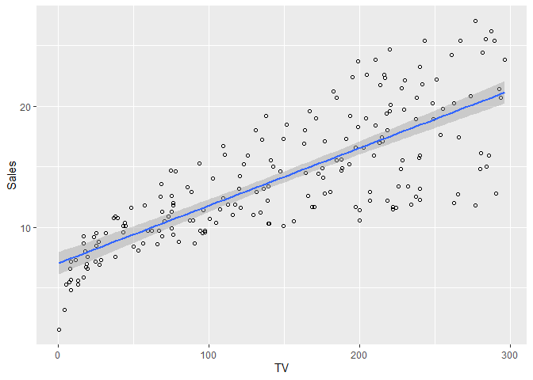

200_Simple_Linear_Regression
================
Sonick
10/21/2022

Simple Linear Regression is a very simple approach for predicting
quantitative or numerical response variable using a single predictor.

Simple Linear Regression assumes mathematical form of:

Y ≈ β0 + β1X

≈ means approximately modelled as β0 is the intercept (Value of Y when X
= 0) β1 is the slope

Since we do not have access the population data, and we always have
sample data, we write this equation as

yˆ = βˆ0 + βˆ1x

where ^ represents estimated value

In linear regression, since we do not know βˆ0 and βˆ1, we estimate them
by fitting data. Our goal is to find these coefficiants such that they
are as close to the possible to the data points we have.

There are a lot of ways we can measure this closeness, however most
common way of doing so is using Least square estimates.

We use a sample data Advertising to show this:

## Viewing the Advertising dataset

``` r
# View the data 
head(Advertising)
```

    ##   X    TV Radio Newspaper Sales
    ## 1 1 230.1  37.8      69.2  22.1
    ## 2 2  44.5  39.3      45.1  10.4
    ## 3 3  17.2  45.9      69.3   9.3
    ## 4 4 151.5  41.3      58.5  18.5
    ## 5 5 180.8  10.8      58.4  12.9
    ## 6 6   8.7  48.9      75.0   7.2

## Preprocessing - Removing Unwanted columns

``` r
# Since X is Serial Number column, removing it
Advertising <- Advertising[,2:5]
```

``` r
# Plot Linear Regression Least square Line; The shaded region around the line is confidence interval of the line; we will discuss confidence interval below
library(ggplot2)
ggplot(data = Advertising, aes(x = TV, y = Sales)) + geom_point(shape = 1) + geom_smooth(method = "lm")
```

    ## `geom_smooth()` using formula 'y ~ x'

<!-- -->

The blue line shows least square estimate by fitting the data and the
shaded region shows 95% confidence interval around the estimates.

The difference between our data point and blue line is the residual

ei = yi −yˆi

We define Residual sum of squares: RSS = e21 + e22 + ··· + e2n,

βˆ1 = βˆ0 =

Using calculus, we can choose βˆ0 and βˆ1 to minimise RSS

``` r
# Applying Linear Model to get intercept and Slope
lm_sales = lm(Sales ~ TV, data = Advertising)
summary(lm_sales) # Review the results
```

    ## 
    ## Call:
    ## lm(formula = Sales ~ TV, data = Advertising)
    ## 
    ## Residuals:
    ##     Min      1Q  Median      3Q     Max 
    ## -8.3860 -1.9545 -0.1913  2.0671  7.2124 
    ## 
    ## Coefficients:
    ##             Estimate Std. Error t value Pr(>|t|)    
    ## (Intercept) 7.032594   0.457843   15.36   <2e-16 ***
    ## TV          0.047537   0.002691   17.67   <2e-16 ***
    ## ---
    ## Signif. codes:  0 '***' 0.001 '**' 0.01 '*' 0.05 '.' 0.1 ' ' 1
    ## 
    ## Residual standard error: 3.259 on 198 degrees of freedom
    ## Multiple R-squared:  0.6119, Adjusted R-squared:  0.6099 
    ## F-statistic: 312.1 on 1 and 198 DF,  p-value: < 2.2e-16

We get Intercept as 7.032 and slope as 0.047. In other words, additional
1000$ increase in advertising spend on TV will increase the sales by
47.5 units and for no advertising, we will get 7032 sales.

## Confidence Interval

Since we get this approximation using sample data, the estimates
obtained from the model will be close to actual population. To measure
this closeness of results with actual population, we will establish a
confidence interval to measure these values.

SE(βˆ0)2 =

SE(βˆ1)2 =

95% confidence interval or basically if we take repeated samples, then
95% of time, the estimate of population will fall within the CI is given
as below: \[βˆ1 − 2 · SE(βˆ1), βˆ1 + 2 · SE(βˆ1)\]

## Hypothesis Testing

Standard error can also be used to perform hypothesis test The most
common hypothesis involves:

H0 : There is no relationship between X and Y Ha : There is some
relationship between X and Y

Mathematically, H0 : β1 = 0 Ha : β1 ̸= 0

We test this hypothesis using a t test to see how far is βˆ1 away from 0

t = βˆ1 − 0 / SE(βˆ1)

We calculate p value, probability of observing any number equal to \|t\|
or larger in absolute value, assuming β1 = 0

a small p-value (less than 5% or 1%) is used to indicate that it is
unlikely to observe such a substantial association between the predictor
and the response due to chance

In out results, since p value is small, we reject null hypothesis and
conclude, that there is a relationship between X and Y.

# Assessing Accuracy of the model

After rejecting null hypothesis, we naturally would be interested to
know the fit of the data.

There are two quantities using which we can assess the accuracy 1.
Residual standard error (RSE) 2. R2 statistic

1.  RSE: RSE is the standard deviation of ϵ (Error) or the average
    amount by which response will deviate from the regression line. RSE
    = sqrt(RSS/(n-2))

RSE provides estimate of lack of fit as an absolute measure, hence it is
always difficult to know what is good value of RSE. Hence we usually go
ahead with other metric which is R2 to estimate accuracy.

2.  R2: R2 is the proportion of variance explained by our model, hence
    it is always between 0 and 1

R2 = TSS − RSS / TSS

TSS = total sum of squares = E(yi − y¯)2 TSS measures the total variance
RSS measures the amount of variability that is left unexplained after
performing the regression

Hence TSS - RSS gives explained variance in the model

Value of good R2 can vary depending on Scenatio for example, if For
instance, in certain problems in physics, we may know that the data
truly comes from a linear model with a small residual error. In this
case, we would expect to see an R2 value that is extremely close to 1,
and a substantially smaller R2 value might indicate a serious problem
with the experiment in which the data were generated. On the other hand,
in typical applications in biology, psychology, marketing, and other
domains, the linear model is at best an extremely rough approximation to
the data, and residual errors due to other unmeasured factors are often
very large. In this setting, we would expect only a very small
proportion of the variance in the response to be explained by the
predictor
