201_Multiple_Linear_Regression
================
Sonick
11/2/2022

Multiple Linear Regression

In Our previous Article, we understood why do we use Regression and what
is simple linear Regression.

Link to this story is here.

In real world, we do not have single variable and we may want to see the
effect of multiple variables with the response variable. Multiple Linear
Regression helps us answer this question.

We would be discussing the Additive approach to regression and then
would also cover how can we add interaction among predictor variables in
subsequent sections.

## Additive Approach:

Mathematically, Multiple Linear Regression can be expressed as:


Y = β0 + β1X1 + β2X2 + ··· + βpXp + ϵ,

Where, βj is the average effect on Y of a one unit increase in Xj ,
holding all other predictors fixed

### Estimating the coefficients:

In Multiple Linear Regression as well, we use the approach of Least
square to estimate the coefficients.


")

When dealing with Multiple linear regression, we may want to understand
- Is there a relationship between response variable? - which predictors
help us in predicting response variable? - how accuraltely can we
predict the response variable? - Given a set of predictors, what should
be response value?

Lets consider the same data set of Advertising we used in our previous
tutorial and fit the model

    ##      TV Radio Newspaper Sales
    ## 1 230.1  37.8      69.2  22.1
    ## 2  44.5  39.3      45.1  10.4
    ## 3  17.2  45.9      69.3   9.3
    ## 4 151.5  41.3      58.5  18.5
    ## 5 180.8  10.8      58.4  12.9
    ## 6   8.7  48.9      75.0   7.2

    ##      TV Radio Newspaper Sales
    ## 1 230.1  37.8      69.2  22.1
    ## 2  44.5  39.3      45.1  10.4
    ## 3  17.2  45.9      69.3   9.3
    ## 4 151.5  41.3      58.5  18.5
    ## 5 180.8  10.8      58.4  12.9
    ## 6   8.7  48.9      75.0   7.2

``` r
lm_sales <- lm(data = Advertising, Sales ~ .)
summary(lm_sales)
```

    ## 
    ## Call:
    ## lm(formula = Sales ~ ., data = Advertising)
    ## 
    ## Residuals:
    ##     Min      1Q  Median      3Q     Max 
    ## -8.8277 -0.8908  0.2418  1.1893  2.8292 
    ## 
    ## Coefficients:
    ##              Estimate Std. Error t value Pr(>|t|)    
    ## (Intercept)  2.938889   0.311908   9.422   <2e-16 ***
    ## TV           0.045765   0.001395  32.809   <2e-16 ***
    ## Radio        0.188530   0.008611  21.893   <2e-16 ***
    ## Newspaper   -0.001037   0.005871  -0.177     0.86    
    ## ---
    ## Signif. codes:  0 '***' 0.001 '**' 0.01 '*' 0.05 '.' 0.1 ' ' 1
    ## 
    ## Residual standard error: 1.686 on 196 degrees of freedom
    ## Multiple R-squared:  0.8972, Adjusted R-squared:  0.8956 
    ## F-statistic: 570.3 on 3 and 196 DF,  p-value: < 2.2e-16

Lets drop the insignificant variable and run the model again

``` r
lm_sales <- lm(data = Advertising, Sales ~ . - Newspaper)
summary(lm_sales)
```

    ## 
    ## Call:
    ## lm(formula = Sales ~ . - Newspaper, data = Advertising)
    ## 
    ## Residuals:
    ##     Min      1Q  Median      3Q     Max 
    ## -8.7977 -0.8752  0.2422  1.1708  2.8328 
    ## 
    ## Coefficients:
    ##             Estimate Std. Error t value Pr(>|t|)    
    ## (Intercept)  2.92110    0.29449   9.919   <2e-16 ***
    ## TV           0.04575    0.00139  32.909   <2e-16 ***
    ## Radio        0.18799    0.00804  23.382   <2e-16 ***
    ## ---
    ## Signif. codes:  0 '***' 0.001 '**' 0.01 '*' 0.05 '.' 0.1 ' ' 1
    ## 
    ## Residual standard error: 1.681 on 197 degrees of freedom
    ## Multiple R-squared:  0.8972, Adjusted R-squared:  0.8962 
    ## F-statistic: 859.6 on 2 and 197 DF,  p-value: < 2.2e-16

We observe that both TV and Radio are significant but Newspaper effect
is not significant on the data

To evaluate our questions; 1. Is there a relationship between predictor
and response variable? Here, we will use hypothesis testing and develop
hypothesis such that H0 : β1 = β2 = ··· = βp = 0 Ha : at least one βj is
non-zero.

We use F statistic to perform this hypothesis test

F = (TSS − RSS)/p / RSS/(n − p − 1) E{RSS/(n − p − 1)} = σ2 and if H0 is
True then, E{(TSS − RSS)/p} = σ2.

Hence when there is no relationship, F - stastistic will be close to 1
If Ha is true then, E{(TSS − RSS)/p} \> σ2; hence F will be greater than
1 When there is no relationship one would observe F value to be close to
1

In Our example, F-statistic is 425.7 much bigger than 1 and p value
associate with this value is much smaller indicating we have sufficient
evidence to reject null hypothesis.

NOTE: apart from observing individual p values, it is always advisable
to see p value of F statistic since in case of large number of
predictors, some p values for variables by chance can also be less that
5%.

(When number of predictors are greater than n, interpreting results
using F value also might not be correct)

2.  Deciding on Important variables: When we have less number of p (Like
    in our example) we can use the individual p values to look for
    important variables. However, when we have large number of p, we may
    get some get some false discoveries.

In such cases, we use techniques like - forward selection: We start with
0 predictors and keep adding variables in subsequent models which are
significant - Backward selection: We start will all predictors and
remove variable with largest variable. Then model with p-1 variable is
fit again and we repeat the same steps until we reach a threshold -
Mixed Selection We start from no variables and add variables with lowest
RSS. However as we add more variables, for some varibales the p value
will increase from the threashold and we remove such variables.

3.  Model Fit: Here we will use R2 to evaluate the fit, which is also
    equal to will be equal to cor(Y,Y^)

4.  Prediction: There are 3 types of errors we could expect in
    prediction

5.  The coefficients are estimates and not true population

6.  We assume linear relationship however true f(X) may not be linear
    (Model Bias)

7.  Irreducable error, which can depend on measurements, condition of
    measurement etc.

Qualitative prediction:

Extensions of Linear Model:

A linear model additive approach says that effect of one predictor X1 is
independent of X2 which may not neccisorly be true. For example,
spending money on Radio advertising may increase effectiveness of TV
advertising. then slope of tv should increase with radio This is also
called as interaction effect.

Y = β0 + β1X1 + β2X2 + ϵ

Adding interaction term here,

Y = β0 + β1X1 + β2X2 + β3X1X2 + ϵ. Y = β0 + (β1 + β3X2)X1 + β2X2 + ϵ

For out Advertising Example, we can see that sales = β0 + β1 × TV + β2 ×
radio + β3 × (radio × TV) + ϵ = β0 + (β1 + β3 × radio) × TV + β2 × radio
+ ϵ meaning, one unit increase in radio will increase TV by β3

``` r
lm_sales <- lm(data = Advertising, formula = Sales ~ TV + Radio + TV:Radio)
summary(lm_sales)
```

    ## 
    ## Call:
    ## lm(formula = Sales ~ TV + Radio + TV:Radio, data = Advertising)
    ## 
    ## Residuals:
    ##     Min      1Q  Median      3Q     Max 
    ## -6.3366 -0.4028  0.1831  0.5948  1.5246 
    ## 
    ## Coefficients:
    ##              Estimate Std. Error t value Pr(>|t|)    
    ## (Intercept) 6.750e+00  2.479e-01  27.233   <2e-16 ***
    ## TV          1.910e-02  1.504e-03  12.699   <2e-16 ***
    ## Radio       2.886e-02  8.905e-03   3.241   0.0014 ** 
    ## TV:Radio    1.086e-03  5.242e-05  20.727   <2e-16 ***
    ## ---
    ## Signif. codes:  0 '***' 0.001 '**' 0.01 '*' 0.05 '.' 0.1 ' ' 1
    ## 
    ## Residual standard error: 0.9435 on 196 degrees of freedom
    ## Multiple R-squared:  0.9678, Adjusted R-squared:  0.9673 
    ## F-statistic:  1963 on 3 and 196 DF,  p-value: < 2.2e-16

We can see that p value associated with interaction term indicates that
it is indeed significant R2 also increase to 96% from 89% indicating
true relationship is not actually additive

(Note: If we include interaction term based on significance, then we
should always include those variables which we have interacted,
irrespective of their p value)

Non Linear Relationships:

We can include non linear function to incorporate Non linear
relationship

for example, lets say we have dataset Auto,

Lets say we want to fit a model to predict mpg using horsepower

``` r
library(ggplot2)
library(ISLR2)
ggplot(data = Auto,aes(x = horsepower,y = mpg)) + geom_point()
```

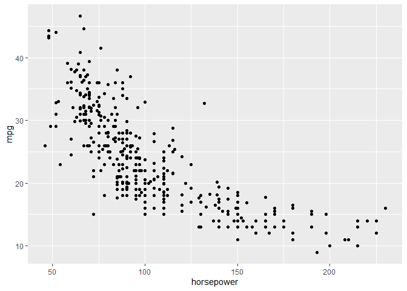<!-- -->

We see this relationship is kind of non linear

``` r
lm_mpg_1 <- lm(data = Auto, formula = mpg ~ horsepower)
summary(lm_mpg_1)
```

    ## 
    ## Call:
    ## lm(formula = mpg ~ horsepower, data = Auto)
    ## 
    ## Residuals:
    ##      Min       1Q   Median       3Q      Max 
    ## -13.5710  -3.2592  -0.3435   2.7630  16.9240 
    ## 
    ## Coefficients:
    ##              Estimate Std. Error t value Pr(>|t|)    
    ## (Intercept) 39.935861   0.717499   55.66   <2e-16 ***
    ## horsepower  -0.157845   0.006446  -24.49   <2e-16 ***
    ## ---
    ## Signif. codes:  0 '***' 0.001 '**' 0.01 '*' 0.05 '.' 0.1 ' ' 1
    ## 
    ## Residual standard error: 4.906 on 390 degrees of freedom
    ## Multiple R-squared:  0.6059, Adjusted R-squared:  0.6049 
    ## F-statistic: 599.7 on 1 and 390 DF,  p-value: < 2.2e-16

Lets try to add horse power sq also here

``` r
lm_mpg_2 <- lm(data = Auto, formula = mpg ~ poly(horsepower,2))
summary(lm_mpg_2)
```

    ## 
    ## Call:
    ## lm(formula = mpg ~ poly(horsepower, 2), data = Auto)
    ## 
    ## Residuals:
    ##      Min       1Q   Median       3Q      Max 
    ## -14.7135  -2.5943  -0.0859   2.2868  15.8961 
    ## 
    ## Coefficients:
    ##                       Estimate Std. Error t value Pr(>|t|)    
    ## (Intercept)            23.4459     0.2209  106.13   <2e-16 ***
    ## poly(horsepower, 2)1 -120.1377     4.3739  -27.47   <2e-16 ***
    ## poly(horsepower, 2)2   44.0895     4.3739   10.08   <2e-16 ***
    ## ---
    ## Signif. codes:  0 '***' 0.001 '**' 0.01 '*' 0.05 '.' 0.1 ' ' 1
    ## 
    ## Residual standard error: 4.374 on 389 degrees of freedom
    ## Multiple R-squared:  0.6876, Adjusted R-squared:  0.686 
    ## F-statistic:   428 on 2 and 389 DF,  p-value: < 2.2e-16

We can see that polynomial term increase R square of the model

``` r
ggplot(data = Auto,aes(x = horsepower,y = mpg)) + geom_point() + 
  geom_line(aes(y = fitted(lm_mpg_1)),color = 'blue') + 
  geom_line(aes(y = fitted(lm_mpg_2)),color = 'red')
```

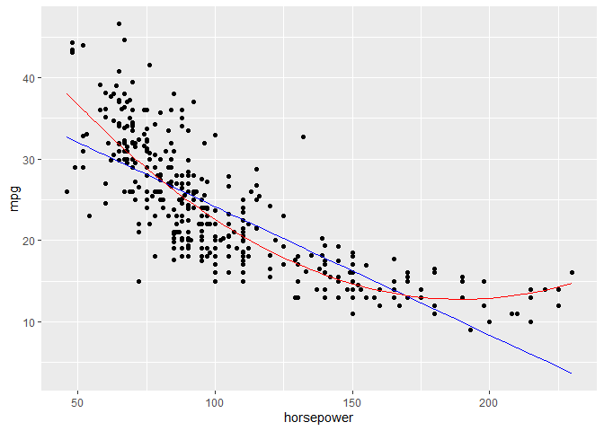<!-- -->
Lets see what happens when we increase the degree of polynomial

``` r
lm_mpg_3 <- lm(data = Auto, formula = mpg ~ poly(horsepower,5))
summary(lm_mpg_3)
```

    ## 
    ## Call:
    ## lm(formula = mpg ~ poly(horsepower, 5), data = Auto)
    ## 
    ## Residuals:
    ##      Min       1Q   Median       3Q      Max 
    ## -15.4326  -2.5285  -0.2925   2.1750  15.9730 
    ## 
    ## Coefficients:
    ##                       Estimate Std. Error t value Pr(>|t|)    
    ## (Intercept)            23.4459     0.2185 107.308  < 2e-16 ***
    ## poly(horsepower, 5)1 -120.1377     4.3259 -27.772  < 2e-16 ***
    ## poly(horsepower, 5)2   44.0895     4.3259  10.192  < 2e-16 ***
    ## poly(horsepower, 5)3   -3.9488     4.3259  -0.913  0.36190    
    ## poly(horsepower, 5)4   -5.1878     4.3259  -1.199  0.23117    
    ## poly(horsepower, 5)5   13.2722     4.3259   3.068  0.00231 ** 
    ## ---
    ## Signif. codes:  0 '***' 0.001 '**' 0.01 '*' 0.05 '.' 0.1 ' ' 1
    ## 
    ## Residual standard error: 4.326 on 386 degrees of freedom
    ## Multiple R-squared:  0.6967, Adjusted R-squared:  0.6928 
    ## F-statistic: 177.4 on 5 and 386 DF,  p-value: < 2.2e-16

``` r
ggplot(data = Auto,aes(x = horsepower,y = mpg)) + geom_point() + 
  geom_line(aes(y = fitted(lm_mpg_1)),color = 'blue',size = 1) + 
  geom_line(aes(y = fitted(lm_mpg_2)),color = 'red', size = 1) + 
  geom_line(aes(y = fitted(lm_mpg_3)),color = 'darkgreen',size = 1)
```

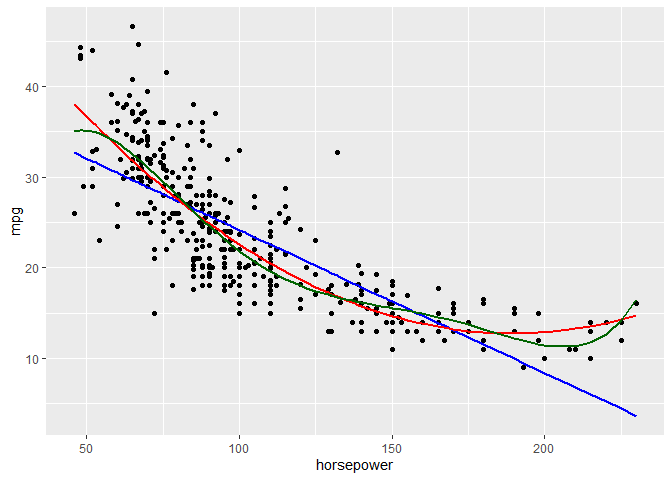<!-- -->
We can see that as we increase degree, the curve becomes wiggly and also
their coefficients are not significant.

Some Assumptions/problems with Linear Regression:

1.  Non-linearity of the response-predictor relationships

The Linear model assumes that relationship between predictor and
response. This can be checked by plotting residuals. There should be no
pattern in residuals. Here in first graph, we can see that there is a U
shaped pattern whereas the other graph looks like without pattern.

``` r
plot(lm_mpg_1)
```

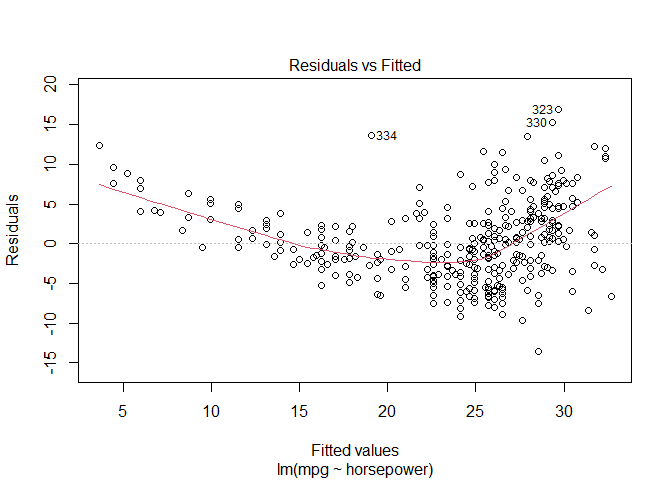<!-- -->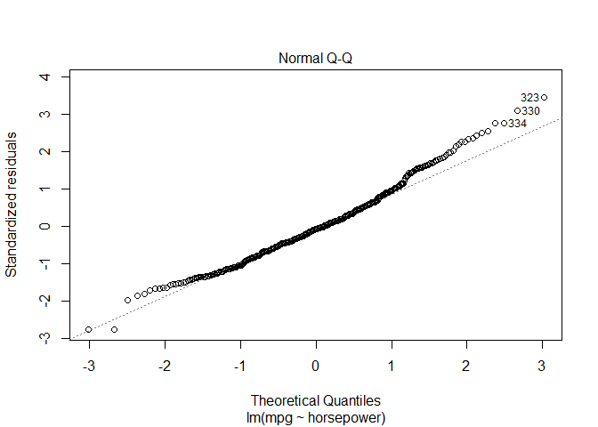<!-- -->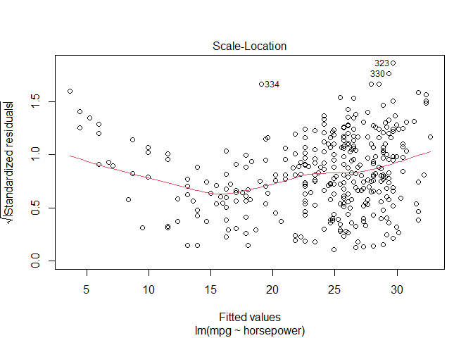<!-- -->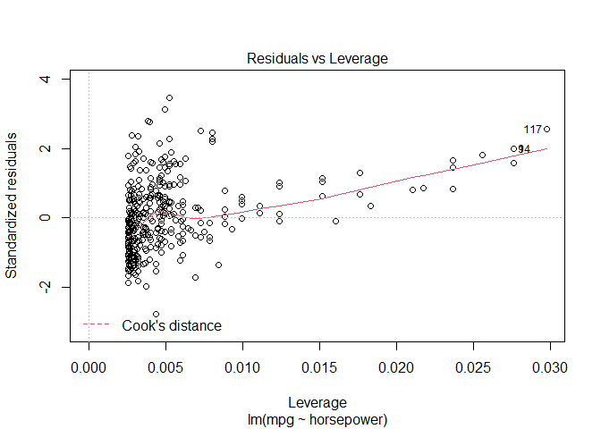<!-- -->

``` r
plot(lm_mpg_2)
```

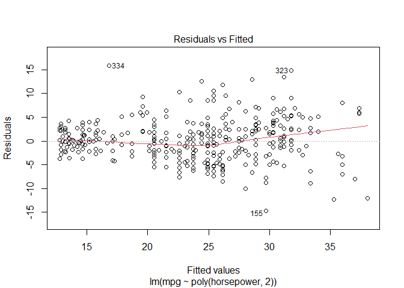<!-- -->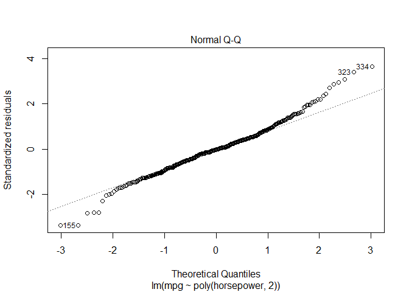<!-- -->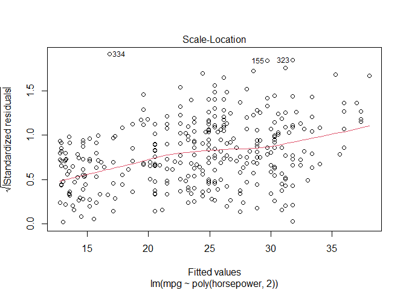<!-- -->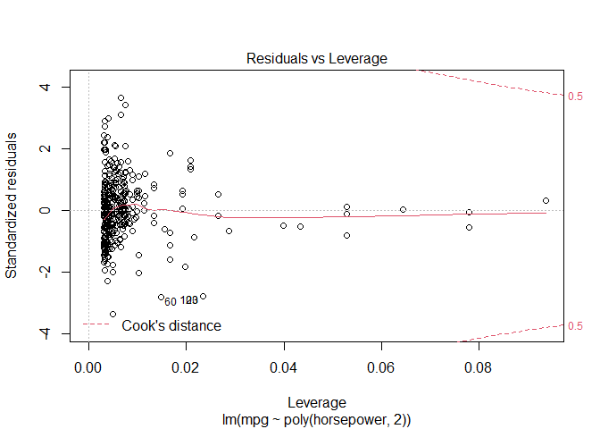<!-- -->
2. Correlation of Error terms:

It means that if we know ϵi, we should have no information about sign of
ϵi+1. This correlation can occur in timeseries data, or if our
predictors are related to each other, for example, in a study if we
predict height using weight, the assumption could be violated if some
people are member of same family and share same diet (as diet acts as a
confounder)

This can also be checked using residual graphs and see if can identify a
trend or not.

3.  Non Constant variance of Error terms:

It assumes that variance of error terms Var(ϵi) = σ2 is constant. it can
also be identified by seeing if residuals have pattern or not. For
example if the residuals graph has a funnel shape of it can indicate
increasing residuals with values meaning non constant variance.

4.  Outliers:

Outliers are values that have very high difference in Y and Y^. Outliers
can cause RSE to increase which can affect the CI. It can be difficult
to decide what is an outlier, hence we can plot studentized residuals to
compute this. computed by dividing each residual ei by its standard
error. Observations with greater than 3 studentized residuals can be
possible outliers

``` r
library(MASS)
```

    ## 
    ## Attaching package: 'MASS'

    ## The following object is masked from 'package:ISLR2':
    ## 
    ##     Boston

``` r
stud_resids_1 <- studres(lm_mpg_1)
stud_resids_2 <- studres(lm_mpg_2)
leverage_1 <- hatvalues(lm_mpg_1)
leverage_2 <- hatvalues(lm_mpg_2)
```

Plot it with leverage

``` r
par(mfrow = c(1,2))

plot(leverage_1,stud_resids_1)
plot(leverage_2,stud_resids_2)
```

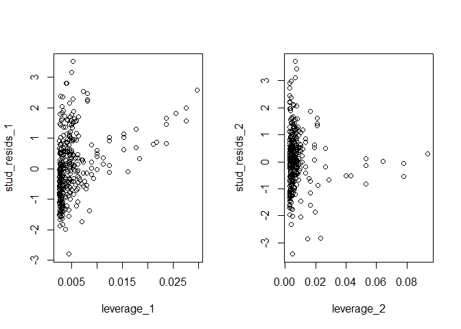<!-- -->
5. High Leverage Points

High leverage points are points which have high or unusal xi value. hi =

6.  Collinearity:

Collinearity occur when one variable is one independent variable is
increased due to other. We can use a correlation matrix, of Variance
inflation factor (VIF) to look for collinearity in our dataset.

``` r
head(Auto)
```

    ##   mpg cylinders displacement horsepower weight acceleration year origin
    ## 1  18         8          307        130   3504         12.0   70      1
    ## 2  15         8          350        165   3693         11.5   70      1
    ## 3  18         8          318        150   3436         11.0   70      1
    ## 4  16         8          304        150   3433         12.0   70      1
    ## 5  17         8          302        140   3449         10.5   70      1
    ## 6  15         8          429        198   4341         10.0   70      1
    ##                        name
    ## 1 chevrolet chevelle malibu
    ## 2         buick skylark 320
    ## 3        plymouth satellite
    ## 4             amc rebel sst
    ## 5               ford torino
    ## 6          ford galaxie 500
